# FM26 artifact

## Table of content

1. [Introduction](#introduction)
2. [Note on this document](#note-on-this-document)
3. [Set Up](#set-up)
4. [Interaction language](#interaction-language)
    - [Representation of interactions](#representation-of-interactions)
    - [Gates](#gates)
5. [Artifact structure](#artifact-structure)
6. [Smoke tests](#smoke-tests)
    - [Composition smoke test](#composition-smoke-test)
    - [Reduced benchmark smoke test](#reduced-benchmark-smoke-test)
7. [Others Composition Examples](#others-composition-examples)
8. [Benchmark](#benchmark)
    - [Step 1: projection, normalization and mutation](#step-1-projection-normalization-and-mutation)
    - [Step 2: composition](#step-2-composition)
    - [Step 3: Normal Form Checking](#step-3-normal-form-checking)
    - [Summary of the workflow for the interaction Game](#summary-of-the-workflow-for-the-interaction-game)
    - [To Execute all three steps in one pass](#to-execute-all-three-steps-in-one-pass)
    - [Interactions of the benchmark](#interactions-of-the-benchmark)


## Introduction

This README file describes the artifact related to the paper ["Specializing anti-unification for interaction
models composition via gate connections"] accepted to the ``FM26`` conference.

The paper proposes an approach to the composition of interaction models using
anti-unification. The program, named `generalizer` is developped in Rust.


## Note on this document

We recommend reading this README file as the joint README.pdf file outside
of the docker container, because of the images illustrations.

## Set Up

The artefact is wrapped in a docker image available on Zenodo(todo: link).
After downloading the image, it is loaded with the following command:

```bash
$ docker load -i generalizer.tar.gz
```

Alternatively, the image can be built from the root of the repository
with the following command:

```bash
$ docker build -t generalizer .
```

After loading or building the image, running the container is done with the following command:

```bash
$ docker run -it --rm generalizer:latest
```
## Interaction language

### Representation of interactions

Our implementation of Interactions models is based on the work of
[Mahe et al.](https://doi.org/10.1016/j.scico.2023.103034) and the tool [HIBOU](https://github.com/erwanM974/hibou_label).

We follow the notation of HIBOU for signature files (.hsf)
and interaction files (.hif).

Let us consider the signature (sig.hsf):
~~~
@message{
	bwin;cwin;close;blose;busy;msg;sig;free
}

@lifeline{
    l0;l1;l2;l3
}
~~~

and the interaction (i.hif):
~~~
loopS(
	seq(
		par(
			alt(
				l0 -- cwin ->|,
				l0 -- bwin ->|
			),
			busy -> l3 
		),
		msg -> l0,
		sig -> l0,
		l0 -- free -> l3
	)
)
~~~

For instance `l0 -- cwin ->|` is an emission of the message `cwin` from lifeline `l0` to 
environment; and `busy -> l3 ` is reception of the message `busy` from environment to lifeline `l3`.
The term `l0 -- free -> l3` represents the transmission of the message `free` from lifeline `l0` to lifeline `l3`,
and is called a `value passing` in the paper.

The above interaction can be visualized as:

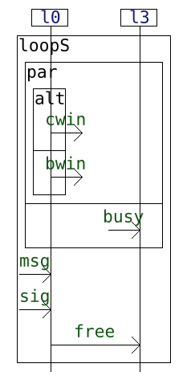

#### Gates

We introduce *gates* in our implementation
to mark complementary
communications for the composition as described in the paper.

Gates are assigned by adding number under brackets next
to the relevant action.

For example, the previous interaction decorated
with gates is:

~~~
loopS(
	seq(
		par(
			alt(
				l0 -- cwin ->| [3],
				l0 -- bwin ->| [1]
			),
			busy -> l3 [5]
		),
		msg -> l0 [6],
		sig -> l0 [7],
		l0 -- free -> l3
	)
)
~~~

which can be visually represented as:

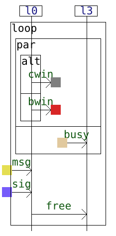


## Artifact structure

The `generalizer` folder contains the following subfolders:

 ```tree
      generalizer
          LICENSE.txt
          README.pdf
          README.md
          Dockerfile
          Executable
          Benchmark
          smoke_tests
          Interactions_examples
          generalizer_sources.zip
          readme
  ```

The Docker image provides a built executable under the folder `generalizer/Executable`.
The smoke tests are located in the `generalizer/smoke_tests` directory, the
benchmark scripts in `generalizer/Benchmark` directory; some 
examples of interactions are provided in `generalizer/Interactions_examples` directory, together
with scripts to compose them. 

## Smoke tests

By running the container, `Docker` will open as shell  inside a directory named `generalizer`.
The smoke tests are located in the `generalizer/smoke_tests` directory. There are 
two smoke tests: a composition smoke test and a reduced benchmark smoke test.

### Composition smoke test

To check whether the composition of two interactions works, we check that 
with the example in the introduction of the paper. It is located in 
`generalizer/smoke_tests/composition_smoke_test`. The folder contains:
- `signature.hsf`: the signature file of the interactions containing the declaration of lifelines and messages.
- `i.hif`: the first interaction.
- `j.hif`: the second interaction.
- `composition_smoke_test.sh`: the script to run the composition of the interaction models `i` and `j`.

The `.hsf` and `.hif` can be visualized with the `cat` command.
```bash
$ cat signature.hsf
$ cat i.hif
$ cat j.hif
```

```bash
$ cd smoke_tests/composition_smoke_test
$ ./composition_smoke_test.sh
```
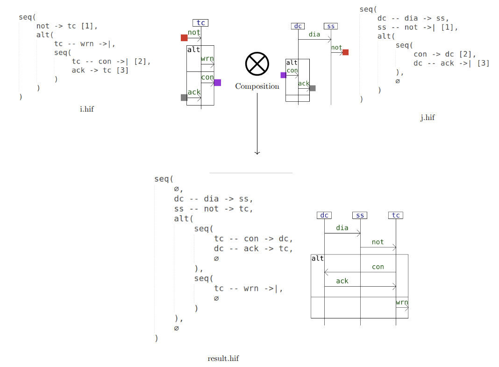

If successful, the success message will be printed in the terminal.
The result will be put in the folder `Composition_output` which contains a folder 
`result` containing the files `result.hif`(interaction file) and `result.png`(visual representation of the result). 
The folder `input` also contains pictures `i.png` and `j.png` of the interactions.

### Reduced benchmark smoke test

To quickly check wheher the benchmark runs successfully, we provide a reduced version of the benchmark.
It is located in `generalizer/smoke_tests/reduced_benchmark_smoke_test`. 
The folder contains the script `reduced_benchmark_smoke_test.sh` to run the small benchmark.

```bash
$ cd smoke_tests/reduced_benchmark_smoke_test
$ ./reduced_benchmark_smoke_test.sh
```
The result will be put in the folder `Benchmark_Output`. It containts a csv file `result_one_pass.csv` containing 
a table akin the exprerimental section of the paper.

To visualize the results inside the docker container, the following command can be used:

```bash
$ csvlook -d '&' Benchmark_Output/result_one_pass.csv | less -S
```
To shrink the size of columns, the following command can be used:

```bash
$ csvlook -d '&' --max-column-width 10 Benchmark_Output/result_one_pass.csv | less -S
```
The following table should be printed (up to some small differences in numbers, which are durations):
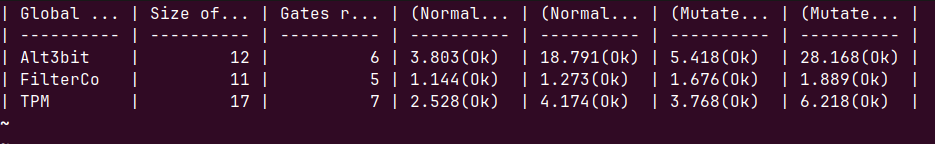

This smoke test executes in one pass the three steps of the benchmark
described in details the Section [Benchmark](#Benchmark) below.

## Others Composition Examples

The folder `Interactions_examples` contains several examples of interactions composition
described in the appendix of the paper, and the example of the introduction. 
Each folder contains a signature file `signature.hsf`, and interaction files `i.hif` and `j.hif`.
In addition there is a script `example_run.sh` to run the composition of the two interactions, in 
exactly the same way as in the smoke test of the composition.

## Benchmark

To execute the benchmark, move into the `Benchmark` folder 
from the root of `generalizer` folder.

```bash
$ cd Benchmark
```

We benchmark is divided into three steps each performed by the scripts:

### Step 1: projection, normalization and mutation

We use the interactions in the folder [Benchmark](../Benchmark/Benchmark)
as our starting global models. For each global interaction $k$, we extract
at most $N_p$ partitions of its set of lifelines $L$ into a pair of subsets each of size at least $\lfloor L/2 \rfloor$.

For each partition $(L_1,L_2)$ of a set of lifelines of a global interaction $r$:

- project $r$ onto $L_1$ and $L_2$ to obtain local interactions $i$ and $j$;
- we normalize $i$ and $j$ using HIBOU to obtain $i_\text{norm}$ and $j_\text{norm}$
  respectively.
- we apply mutation operations to $i$ and $i$, with consists of successively
  applying $N_m$ times one of the following rewrite operation selected uniformly
  at random: $\textsf{alt}(x,y) \rightarrow \textsf{alt}(y,x)$ and $\textsf{par}(x,y) \rightarrow \textsf{par}(y,x)$.
  We obtain the interactions $i_\text{mut}$ and $j_\text{mut}$ from $s$ and $t$ respectively.
  The mutations are done with [Maude](https://maude.cs.illinois.edu/).

```bash
$ ./benchmark_step_1_projection.sh
```

The program will create a folder `Benchmark_Output` containing 
a folder for each starting global interaction.

In the case of the interaction `Game`, we have the following structure:
```tree
    Game
        input_global_interaction
             Game.hsf
             Game.hif
        Partition0
            original_locals
                i1.hif
                i1.png
                i1_tree.png
                i2.hif
                i2.png
                i2_tree.png
            with_mutated_locals
                mutated_local_interactions
                    i1.hif
                    i1.png
                    i1_tree.png
                    i2.hif
                    i2.png
                    i2_tree.png
                results_with_rule_fail
                results_without_rule_fail
            with_normalized_locals
              ...
        Partition1
            ... 
        Partition2
            ...
        Partition3
            ...
        Partition4
            ...
```

The folder `original_locals` contains the 
local interactions `i1` and `i2` obtained after the projection
of the global interaction.

The folders `with_normalized_locals` and `with_mutated_locals` have the same structure, as well as 
the partitions folders.

The folders `results_with_rule_fail` and `results_without_rule_fail` 
are empty at this stage, are are meant to contain the results of the composition
with and without the rule $\textsf{Fail}$, in the next step.

### Step 2: composition

We compose the pairs $(i_\text{norm},j_\text{norm})$ and $(i_\text{mut},j_\text{mut})$.
The result of the composition is normalized with HIBOU an compared to the normal form of
the starting interaction $k$. 

In the case of the interaction `Game`, this step will
compose the interaction `i1.hif` and `i2.hif` in the folders of each of the folders
`partition{i}/with_normalized_locals/normalized_local_interactions` 
and `partition{i}/with_mutated_locals/mutated_local_interactions`.


```bash
$ ./benchmark_step_2_composition.sh
```

```tree
    Game
        Game_composition_durations.csv
        input_global_interaction
             Game.hsf
             Game.hif
        Partition0
            original_locals
                i1.hif
                i1.png
                i1_tree.png
                i2.hif
                i2.png
                i2_tree.png
            with_mutated_locals
                mutated_local_interactions
                    i1.hif
                    i1.png
                    i1_tree.png
                    i2.hif
                    i2.png
                    i2_tree.png
                results_with_rule_fail
                    result.hif
                    result.png
                    result_tree.png
                    time.txt
                results_without_rule_fail
                    result.hif
                    result.png
                    result_tree.png
                    time.txt
            with_normalized_locals
                 ...
        Partition1
            ... 
        Partition2
            ...
        Partition3
            ...
        Partition4
            ...
```
The folders `results_with_rule_fail` and `results_without_rule_fail` contain the results of the composition
with and without the rule $\textsf{Fail}$.  The duration
of the compositions are in the file `time.txt` in each folder.

This step produces a csv file `results_step_2.csv` in the folder `Benchmark_Output`.

You can visualize it with the following command:

```bash
$ csvlook -d '&' Benchmark_Output/results_step_2.csv | less -S
```
Or with column shrinked down:

```bash
$ csvlook -d '&' --max-column-width 10 Benchmark_Output/results_step_2.csv | less -S
```
We obtain the following table:


Each interaction corresponds to a row in the table.
The second column indicates the size of each interaction,
while the third column shows the range of the number of gates
in local interactions with respect to partitions of lifelines.
The last four columns represent the average composition duration
across partitions, with and without the rule **Fail**.
In particular, the fourth and fifth columns report the average duration
for the composition of normalized local interactions,
and the last two columns report the average duration for the mutated
local interactions.

In addition, in each folder corresponding to a global interaction,
there is a `.csv` file showing the composition duration for each partitions
non-averaged. For example, for the interaction `Game`, such a file is
`Game/Game_composition_durations.csv`. It contains the following table:

TODO (fig)

### Step 3: Normal Form Checking

In this step, we check whether the normal form of the  results of compositions
in the previous step is the same as the normal form of the original interactions.

It is accomplished by applying the normal form checking algorithm of [HIBOU](https://github.com/erwanM974/hibou_label)
to the interactions obtained in the previous step.

We execute the following command:

```bash
$ ./benchmark_step_3_nf_checking.sh
```
It produces a csv file `results_step_3.csv` in the folder `Benchmark_Output`.
The new csv file is basically `results_step_2.csv` 
with a verdict (Ok) besides durations to confirm that the normal form of the result
of each composition across partitions matches with
the normal form of the original interaction before projections.

The final table should be similar to the one in the 
experiment section of the paper (up to some small differences in numbers,
due to the randomness of the mutation operations and different 
execution environments). 

An execution gives the following table:
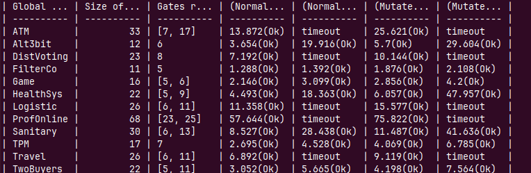

While the paper table is as follows:

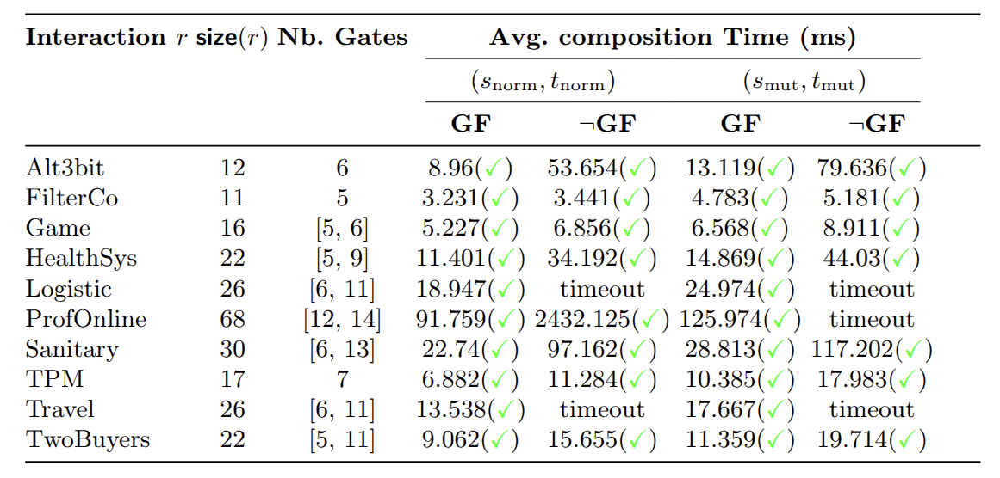

The `Ok` in the csv files are represented
by green checkmarks in the table of the paper.


### Summary of the workflow for the interaction Game

The following figure illustrates our protocol with the
Game global interaction, with only the mutation scenario.

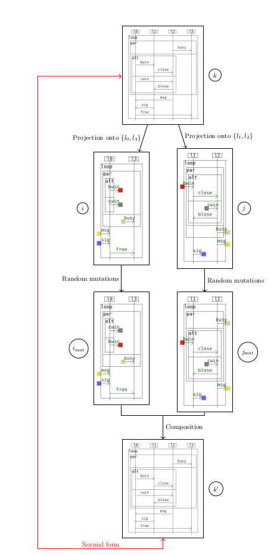

### To Execute all three steps in one pass

To execute all three steps in one pass, we can use the script `benchmark_one_pass.sh`.

```bash
$ ./benchmark_one_pass.sh
```
It directly produces a csv file `result_one_pass.csv` in the folder `Benchmark_Output`
which is the same as the one produced at the end of step 3.

To take a closer look at the command running the benchmark in one 
pass, The subcommand to run the benchmark is `benchmark`. It takes as arguments:

- the name of the subfolder containing the interactions. In the downloadable folder, it is Benchmark.
- the number of mutation  per partition
- the maximal number of random partitions extracted by global interaction.
- Timout in seconds


We can add flags, `-m` to have the duration in milliseconds,
`-d` to draw the models for visualization.

The command to execute to have the result in the table above is:

```bash
$ generaliser benchmark Benchmark 7 5 60 -m 
```

It means:

For each global interaction, at most 5 partitions of its lifelines will be extracted;
after projection onto the partitions, 7 random mutations are operated
in the local interactions. The timout threshold is of 60s. the flag -m means that
in the output csv file, the duration will be given in milliseconds.
The theory for the composition is ACU (all the rules are used).

To draw the interactions involved in the process, we can use the flag `-d`.

### Interactions of the benchmark

We present in the following table sequence diagram
representation of the interactions of the benchmark,
which files are in the folder [Benchmark](../Benchmark/Benchmark).
Those interaction were adapted from examples and experiments from
the literature.


| Name                     | Interaction graphical representation                                                      | Reference                                        |
|--------------------------|-------------------------------------------------------------------------------------------|--------------------------------------------------|
| Alternating3Bit Protocol |        | [Lange et al.](https://doi.org/10.1145/2676726.2676964) |
| Filter collaboration     |       | [Lange et al.](https://doi.org/10.1145/2676726.2676964) |
| Game                     | 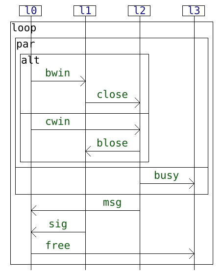                | [Lange et al.](https://doi.org/10.1145/2676726.2676964) |
| Health System            |         | [Lange et al.](https://doi.org/10.1145/2676726.2676964) |
| Logistic                 |          | [Lange et al.](https://doi.org/10.1145/2676726.2676964) |
| Professor Online         | 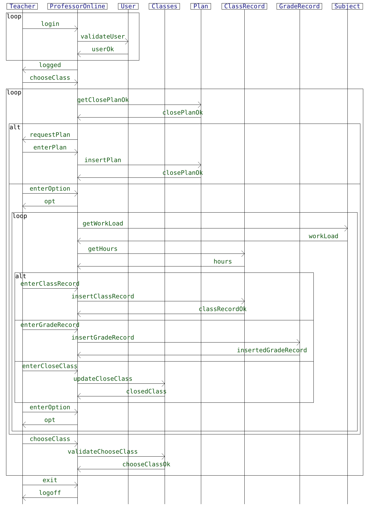    | [Rocha et al.](https://doi.org/10.1007/s11219-020-09531-0) |
| Sanitary Agency          |          | [Lange et al.](https://doi.org/10.1145/2676726.2676964) |
| TPM Contract v2          | 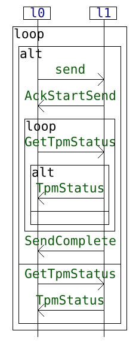                   | [Lange et al.](https://doi.org/10.1145/2676726.2676964) |
| Travel                   |             | [Bouma et al.](https://doi.org/10.1007/978-3-031-30820-8_3) |
| Two Buyers protocol      |        | [Honda et al.](https://doi.org/10.1145/2827695)  |
| ATM                      | 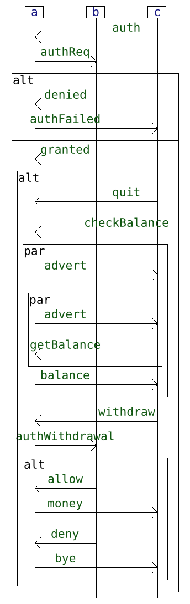                   | [Edixhoven et al.](https://doi.org/10.1016/j.jlamp.2023.100919) |
| Distributed Voting       | 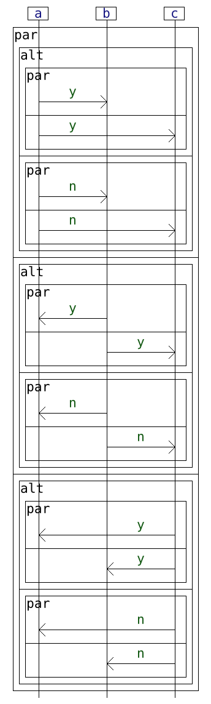 |  [Edixhoven et al.](https://doi.org/10.1016/j.jlamp.2023.100919)|


