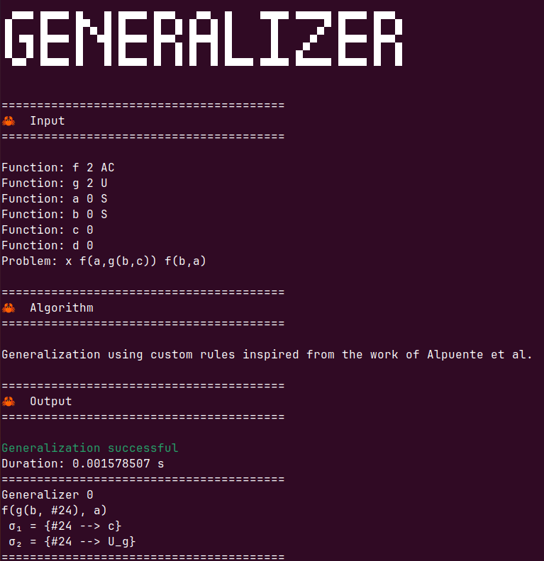
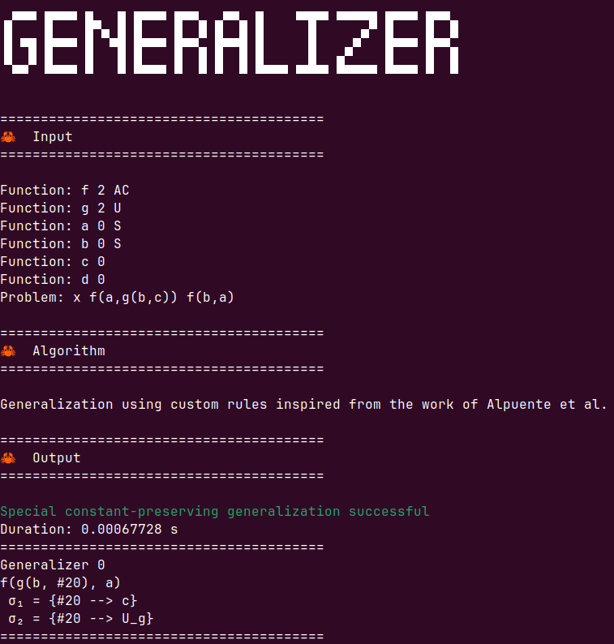

[← Back to main README](../README.md)


The subcommands for the anti-unification are `lgg` for regular anti-unification and `sclgg` for special constant preserving anti-unification.

Our algorithm is inspired from the work of [Alpuente et al(2014)](https://doi.org/10.1016/j.ic.2014.01.006).

### Sub-commands

The syntax of the command for standard (unrestricted) anti-unification is :

```
generalizer lgg <path_to_file.txt>
```

The syntax of the command for special constant-preserving anti-unification is :

```
generalizer sclgg <path_to_file.txt>
```

The `<path_to_file.txt>` refers to a file that contains
the specification of the anti-unification problem.

### Specification of the problem in the file given as argument

#### Declaration of individual function symbols

In the file given to argument to the program, all the function symbols (including constant symbols)
must be declared. The syntax to do it is:

```
Function: <name> <arity> <Axioms>?
```

The `<name>` of the function is a string that must start with a letter. Its `<arity>` is an integer.
Constant symbols are of arity 0.

For example to declare a function symbol `f` 
of arity `2` and a constant symbol `a`, we write:

```
Function: f 2 
Function: a 0
```

The `<Axioms>` field is an optional string that can be used to
provide a more precise specification of binary operators (of `<arity>` 2) or constants (of `<arity>` 0).

#### Axioms for binary function symbols

For a binary function symbol `f`, the `<Axioms>` field can be a string that contains a subset of the letters in `{A,C,U}`. If it contains:
- `A`, then the operator `f` is associative i.e., one considers the axiom `f(x,f(y,z))≈ f(f(x,y),z)`.
- `C`, then the operator `f` is commutative i.e., one considers the axiom `f(x,y)≈ f(y,x)`.
- `U<e>`, then the operator `f` has a neutral element `e` (which is a string representing a constant that may or may not be declared. In case `e` is not declared, then `U<e>` count as a declaration of the constant symbol `e`) i.e., one considers the axiom `f(x,e)≈x` and `f(e,x)≈ x`.


For example to declare a function symbol `f` which is associative, we write:

```
Function: f 2 A
```

An for a function `g` that is associative, commutative with unit, we write:

```
Function: g 2 ACU<e_g>
```

Other combinations like AU (associative-unit) or CU(commutative-unit) are also possible. The order of the charaters `A`, `C` or `U` do not matter.


#### Axioms for constants

For a constant function symbol `a`, the `<Axioms>` field may only be left empty or take the value `S`.

If it is `S` then, this constant `a` is declated as a special constant for the special constant-preserving anti-unification.

For example, to declare a spacial constant `a`, we write:

```
Function: a 0 S
```

#### Declaration of the anti-unification problem

A problem is declared as follows:

    Problem: x t t'

where `t` and `t'` are the terms to generalize. 
Every function symbols that appear in `t` and `t'` must be declared.

For examples of problem specification, see the Example folder.


### Execution of the anti-unification algorithm

The file [example6.txt](../Interaction_examples/Anti-unification/exemple6.txt) in the [Example/Anti-unification](../Interaction_examples/Anti-unification) folder
contains the following problem:

```
Function: f 2 AC
Function: g 2 U<e_g>
Function: a 0 S
Function: b 0 S
Function: c 0
Function: d 0
Problem: x f(a,g(b,c)) f(b,a)
```

The signature contains an associative-commutative function symbol `f`,
a symbol `g` with unit element, two constants `c` and `d`. In addition there are two
special constants `a` and `b`. 

The command to execute the resolution of the standard anti-unification problem is:

```
generalizer lgg example6.txt
```

We obtain the output:




Similarly, for the special-constant preserving anti-unification,
we execute the command:

```
generalizer sclgg example6.txt
```

We obtain the following output:



If special constants are declared, the `lgg` subcommand will ignore the declared `S` axioms.

The program will return a list of generalizations. Redundant generalizations
are eliminated using a brute-force AC-matching algorithm. However, our matching
algorithm do not include unit element yet. So redundant generalization might
appear in the results if the problem contain a function symbol with unit element.

> :memo: The sclgg command might return a failure verdict in the case no special 
> constant-constant preserving generalization is found.

###  Flags

Flags might be provided to configure the anti-unification commands.


#### To only use the rules of the algorithme of [Alpuente et al(2014)](https://doi.org/10.1016/j.ic.2014.01.006)

Use the flag -a or --alpuente

An example is:
```
generalizer lgg example1.txt -a
```

#### verbose

The flag verbose print in command line the computation history of each least general generalisations.

An example is:
```
generalizer lgg example1.txt -v
```

or
```
generalizer lgg example1.txt --verbose
```

The same flag remain available for the command clgg.

#### Rule Fail for the computation sclgg

To use the rule $\textsf{Fail}$ for the anti-unification,
use the flag `-f`.


