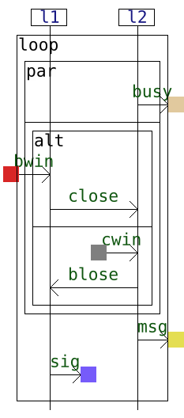
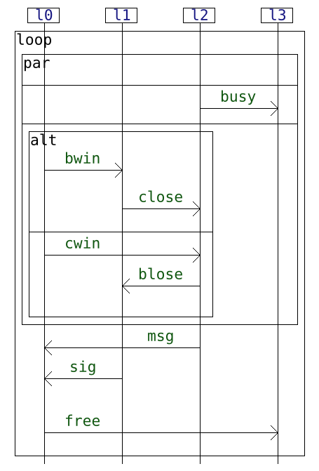

[← Back to main README](../README.md)

# Interaction Composition

We have implemented a composition procedure for interactions models.

Interaction language is a term-based formalism for the specification of 
distributed systems. Its formal semantics was developed by [Mahe et al.](https://doi.org/10.1016/j.scico.2023.103034).

Our implementation of interactions is based on [HIBOU](https://github.com/erwanM974/hibou_label), 
which offer various manipulation utilities for interactions.

As an introduction to interaction, we propose a short [tutorial](interactions.md) on
the syntax of interaction with gates, and their representation as .hsf (HIBOU Signature file)
and .hif(HIBOU interaction file) files.


To compose two interaction models, use the `compose` command with tree arguments:
- a .hsf file, the signature file,
- two .hif files, which represent the interactions to compose. The two interaction
sharing the same signature.

For example:

```
generalizer compose sig.hsf i.hif j.hif
```

The program will compute the composition of the two interactions, and draw the 
result in a folder called "Composition Output".


##  Flags 

### Restriction of the anti-unification theory

We can restrict the theory under which the composition will happen.
There are many possibilities. By default the theory considered is
ACU (associativity-commutativity-unit). We can restrict the theory by
providing one of the following flags:

`--S` for syntactic generalization (no equations)

`--A` or `-A` for generalization modulo associativity

`--C` or `-C` for generalization modulo commutativity

`--U` or `-U` for generalization modulo unit

`--AC`  for generalization modulo associativity and commutativity

`--AU`  for generalization modulo associativity and unit

`--CU` for generalization modulo commutativity and unit

`--ACU` (optional, the theory is ACU by default) for generalization modulo associativity-commutativity-unit.

Those flags are mutually exclusive.


For example, to compose modulo AU, we can use the following command

```
generalizer compose sig.hsf i.hif j.hif --AU
```

### To only use the rules of the algorithme of [Alpuente et al(2014)](https://doi.org/10.1016/j.ic.2014.01.006)

Use the flag `-a` or `--alpuente`

An example is

```
generalizer compose sig.hsf i1.hif i2.hif -a
```

### verbose

The flag verbose print in command line the
computation history of each least general generalisations.

The flag is `-v` or `--verbose`

An example is:

```
generalizer compose sig.hsf i1.hif i2.hif -v
```

### Rule Fail for the special constant-preserving anti-unification

To use the rule $\textsf{Fail}$ for the anti-unification,
use the flag `-f`.


# Example 

As an example, we describe the execution of 
an [example](../Examples/Composition/example1).

### Common signature file (.hsf)

The two local interaction share 
the same signature file [sig.hsf](../Examples/Composition/example1/sig.hsf).

~~~
@message{
    bwin;cwin;close;blose;busy;msg;sig;free
}

@lifeline{
    l0;l1;l2;l3
}
~~~

### Local interaction $i$

We give below the first local 
interaction [i.hif](../Examples/Composition/example1/i.hif)
and its sequence diagram representation.

~~~
loopS(
	seq(
		par(
			alt(
				seq(
					l0 -- cwin ->| [3],
					∅
				),
				seq(
					l0 -- bwin ->| [1],
					∅
				)
			),
			busy -> l3 [5]
		),
		msg -> l0 [6],
		sig -> l0 [7],
		l0 -- free -> l3
	)
)
~~~


### Local interaction $j$

The second local interaction [j](../Examples/Composition/example1/j.hif) and its graphical 
representation is as follows.  

~~~
loopS(
	seq(
		par(
			l2 -- busy ->| [5],
			alt(
				seq(
					bwin -> l1 [1],
					l1 -- close -> l2
				),
				seq(
					cwin -> l2 [3],
					l2 -- blose -> l1
				)
			)
		),
		l2 -- msg ->| [6],
		l1 -- sig ->| [7],
		∅
	)
)
~~~




### Composition

We compose the interaction $i$ and $j$
with the following command:

```
generalizer compose sig.hsf i.hif j.hif
```

The result is the following interaction.

~~~
loopS(
	seq(
		par(
			∅,
			l2 -- busy -> l3,
			alt(
				seq(
					l0 -- bwin -> l1,
					∅,
					l1 -- close -> l2,
					∅
				),
				seq(
					l0 -- cwin -> l2,
					l2 -- blose -> l1,
					∅,
					∅
				)
			)
		),
		l2 -- msg -> l0,
		l1 -- sig -> l0,
		∅,
		∅,
		∅,
		l0 -- free -> l3,
		∅
	)
)
~~~

